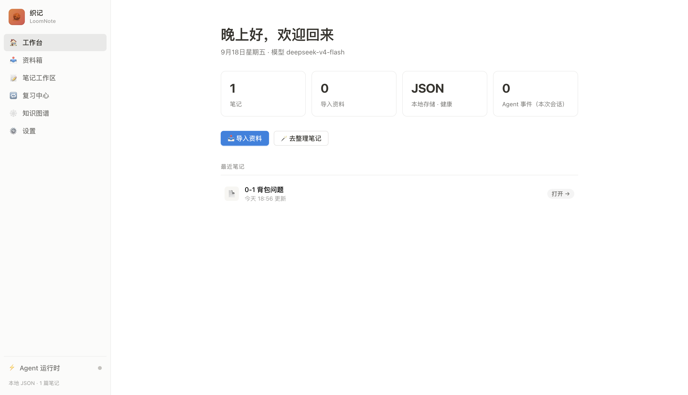
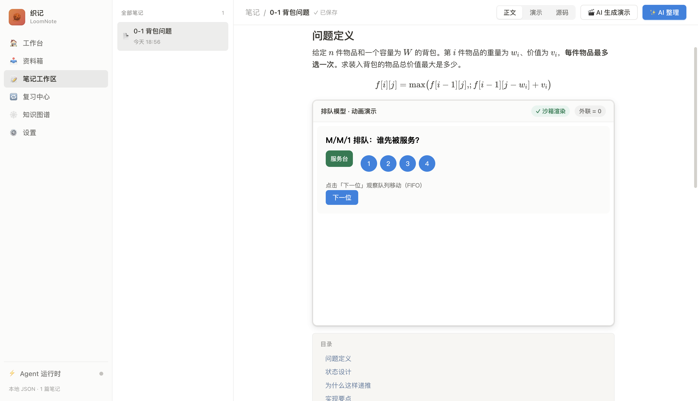
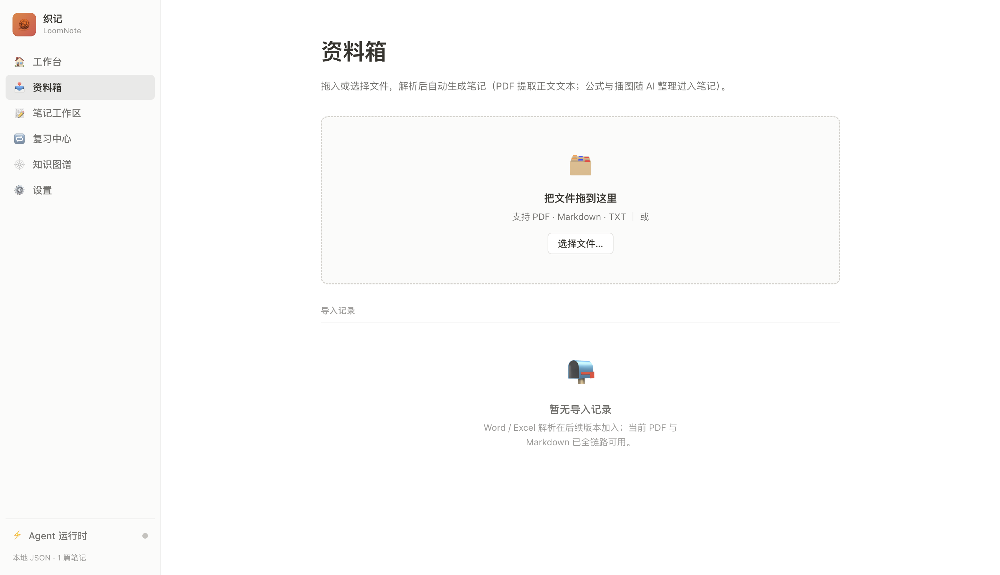
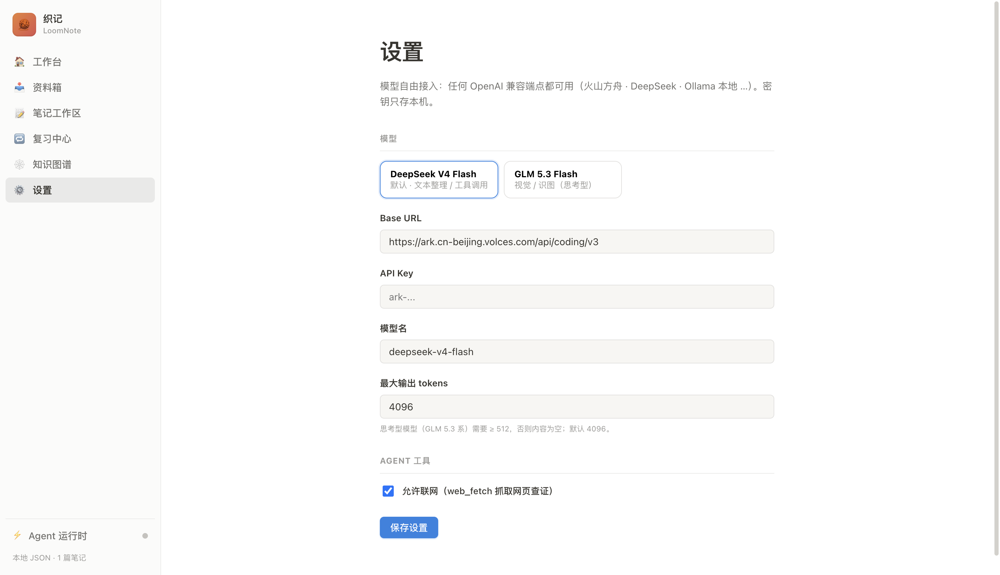

# 织记 LoomNote

[](https://github.com/PUFFERFISHTNT/loomnote/actions/workflows/ci.yml)

**Local-first AI study companion.** Turn a lecture PDF into a living, exam-ready note — structured Markdown with KaTeX formulas, tables, self-test questions, and interactive HTML demos embedded exactly where a concept benefits from being seen moving (an animated queue, a step-through recursion, a clickable state machine).

> One specific user, one concrete task, end to end on your own computer. An AI agent does the organising *in plain sight*: import a file, type a requirement, watch it plan/call tools/stream the note live, interrupt and redirect at any moment.

## Features

- **Smart import** — drag PDF / Markdown / TXT into the inbox; text is extracted locally (pdf.js). Unsupported types are rejected with a clear message, never silently corrupted.
- **Agentic organising** — a harness agent (plan → call tools → observe → revise) reorganises material into structured Markdown; type requirements like *"add a demo of the queueing problem"* and it adapts.
- **Mixed md + HTML notes** — Markdown as the single source of truth; `:::demo` slots carry sandboxed interactive HTML demos (CSP + sandboxed iframe, zero external requests).
- **Real-time, visible agent** — a dedicated runtime panel shows every step (plan, tool calls, live stream); stop, re-enter a requirement, and watch the note re-render live.
- **Self-test questions** — the agent generates questions with answers and explanations inline.
- **Local-first + BYOK** — all data stays in a local SQLite store; bring your own LLM key (any OpenAI-compatible endpoint). No cloud account, no server.
- **Multi-provider** — built-in presets (DeepSeek official API, Volcengine Ark Coding Plan, GLM 5.3 Flash, local Ollama) plus unlimited custom endpoints.

## Screenshots

| Workbench | Note with embedded demo |
|---|---|
|  |  |

| Inbox | Settings · providers |
|---|---|
|  |  |

## Quick Start (development build)

Requirements: Node.js 24+, pnpm 10.

```bash
# one-command setup (installs deps, builds, prints launch hint)
./scripts/setup.sh          # macOS / Linux
.\scripts\setup.ps1         # Windows

# or manually
pnpm install
pnpm test                   # 61 tests
pnpm typecheck
pnpm build
./scripts/start.sh          # launch the app
```

> The app is local-first: configure your LLM endpoint under **Settings** (a provider preset is pre-filled) and paste your own API key. The key stays on your machine.

## Development

```
packages/core/     IR parsing · demo HTML discipline validator · query feature analysis
packages/memory/   memory engine (chunker / dedup / recall / folding / rules)
packages/agent/    harness runtime (SSE provider · dual tool protocol · tool registry · agent loop)
apps/desktop/      Electron 43 app (main / preload / renderer · demo sandbox · screenshot mode)
docs/              design blueprint (final/) + working lessons (WORKFLOW_LESSONS.md)
```

- `pnpm test` — unit + e2e suite (parsers, agent loop, memory, sandbox validator, IPC)
- `pnpm typecheck` — TS strict across all packages
- CI: GitHub Actions dual matrix (macOS + Windows)

## Documentation

- [docs/final/00-项目总纲.md](docs/final/00-项目总纲.md) — project constitution & ADR decisions
- [docs/final/02-产品定义与功能规划.md](docs/final/02-产品定义与功能规划.md) — product definition
- [docs/final/03-技术架构与工程设计.md](docs/final/03-技术架构与工程设计.md) — architecture & engineering
- [docs/final/04-记忆引擎与智能进化.md](docs/final/04-记忆引擎与智能进化.md) — memory engine design
- [docs/final/05-开发执行计划.md](docs/final/05-开发执行计划.md) — milestones & acceptance
- [docs/final/07-安全基线.md](docs/final/07-安全基线.md) — security baseline
- [WORKFLOW_LESSONS.md](WORKFLOW_LESSONS.md) — field-tested pitfalls (maintainers)

## License

UNLICENSED — all rights reserved. This is a private course/product project; licensing to be decided before any public release. See [LICENSE](LICENSE).

## Course

Built as the team project for **AILT9019 · AI Literacy II** (HKU, Fall 2026). Proposal (not public): course deliverable, kept out of this repository.
